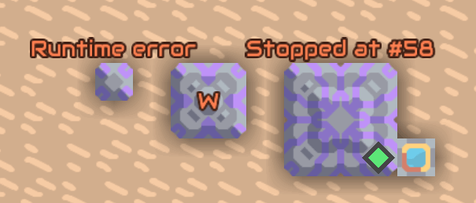

# Mlog Dev Tools

[中文介绍](README_zh.md)

A mod formely known as Mlog Asserions.

> [!TIP]
> A separate release is made for Mindustry Build 160 and Mindustry Build 154.2 or later (up to 159.7). Use the mod browser to install the correct version of the mod for your version of Mindustry.
A mod formely known as Mlog Assertions.

> [!NOTE]
> Using this mod on maps with lots of processors may impact the game's performance.

This mod aims to make debugging in Mindustry Logic a bit easier. Provided functionality:

* Enhanced **Vars** screen: showing numeric values in full precision and color values, sorting variables by name, copying variables and the text buffer contents to the clipboard.
* **Memory** screen for inspecting contents of memory blocks, using the same interface as the **Vars** screen. Includes a command to clear (reset) the contents of memory blocks.
* Settings for overriding instruction limit, by up to 1000 instructions. This allows you to insert debugging code (e.g., additional `print` instructions) into your code, even if the original instruction limit is exceeded.
* **Snapshots** allow saving, reviewing and restoring the state of logic processors, memory blocks and all other blocks on the map. A snapshot can be created manually or using a logic instruction. A limited number of snapshots is kept for each block, allowing to review the exact block state at the time the smapshot has been created.
* A **profiler** for gathering statistics about individual processor instructions execution.  
* Custom mlog instructions for performing runtime checks, logging messages, reporting errors, triggering a bbreakpoint, taking snaphots and managing profiling.
* Visual indication of stopped processors, processors executing a `wait` instruction, and failed runtime checks, directly on the map.



# Vars screen

The **Vars** screen has been enhanced:
* Additional processor variables (the contents of the text buffer, current wait time, `@unit`, `@ipt`) are included.
* Numeric values are displayed in configurable precision. Integer values are clearly distinguished from decimal ones.
* Numeric values in the color range are formatted as color literals (e.g., `%e55454ff`), the color itself is presented using a glyph.
* String values no longer cause overflow and are correctly rendered, including the color tags. 
* Option to choose between formatting the numbers in hexadecimal or decimal base (including memory cell addresses).
* Option to sort variables by name or revert to their original order.
* Option to hide temporary variables and processor links.
* Commands to copy the variable list or the contents of the text buffer to the clipboard (in previous versions of this mod, these buttons have been included directly on the processor screen) or to write it into a file.

# Inspecting memory blocks

By tapping a memory block, a configuration menu is now displayed. The button opens a **Memory** screen, similar to the **Vars** screen described above. All options relevant to the specifics of memory blocks are available. Furthermore, the **Edit** button allows you to clear the contents of memory blocks, export them to the clipboard or a file, and import them back.

The exported data  may be modified (for example in a spreadsheet) and imported back into the memory block. The columns of the table are separated by tabs, and the address of a cell is always given in decimal. Strings are written as literals enclosed in quotes, with the characters which would either be lost or break the table encoded using escape sequences (`\n`, `\"`, `\\`, `\uXXXX`). Numbers may be entered in the decimal, color, hexadecimal or binary form, and values which are not finite are written and imported as `null`, as they are not representable in memory blocks. Lines which cannot be parsed are reported and skipped, and the memory block is only changed once the whole table has been parsed. Values having no representation in the text form (references to units, buildings and contents) are exported as well, but cannot be restored.

# Inspecting other blocks

By tripple-tapping any blok, the **Properties** screen is displayed. The screen contains a list of all properties of the block in real-time in a format similar to the **Vars**/**Memory** screens. 

# Snapshots

A snapshot captures the state of a processor (all its variables), memory block (all cells) or a general block (all senseable properties). The mod allows creating and viewing snapshots.

## Snapshot types

There are several types of snapshots:

* _isolated_: keep a state of just a single block. Can be created using the `snapshot` instruction.
* _connected_: keep a state of a central block and related entities (blocks and units). Related blocks and units are those which are stored in any of the variables of the central block (typically a processor or a memory block). in case of processors, all units controlled by the processor at the time of the snapshot's creation are also included. 
* _recording_: a special snapshot which records the execution of several instructions. It can be created using the `snapshot` instruction, which specifies the target (either `@this`, or some other processor) and the number of steps to record. A recording snapshot shows the initial state of the processor and any connected blocks, and when selected in the snapshot list, allows navigation thorugh individual instruction-related snapshots. Each instruction snapshot shows the variables and contains any objects used by the instruction. The number of individual snapshots stored in a recording snapshot is subject to the snapshot limit in the settings.
* _global_: a global snapshot holds the state of all _logic_ blocks on the map (i.e., only processors and memory cells, not all blocks in general).

Snapshots are always assigned to a specific block and are kept in a list for that block. When the number of snapshots reaches a (configurable) limit, older snapshots get removed from each block.

Connected, recording and global snaphots are reachable from any block included in them. A snapshot ceases to exist when it ages out of all blocks contained in it.

> [!NOTE]
> Snapshots aren't saved with the map; when the map is closed, all snapshots are lost.

## Snapshot creation and usage

A connected snapshot can be created from an UI, using the **Vars**/**Memory**/**Properties** screens, or (in case of processors and memory cells) using the block configuration menu.

A `snapshot` instruction can create any type of snapshot, using any block as the central one. There's no rate limit on creating snaphsots, but obviously there can be performance problems when the feature is abused.

Snapshots can be inspected using the Vars/Memory/Properties screens. A processor or memory state can be restored from a snapshot.

A snapshot can be deleted from the UI.

## User interface

The memory block gets a configuration menu for creating and viewing snapshots. The processors' configuration menu is enhanced with buttons for creating and viewing snapshots.

A brief help is available on the **Vars**/**Memory**/**Properties** screens.

## Settings

Snapshots can be completely deactivated in settings by seting the maximum number of kept snapshots to 0. When disabled, snapshots can'T be created in any wany and no snapshot-related elements appear in the UI.

It is possible to activate creating a snapshot when a breakpoint it hit or an assertion fails.

# Profiler

By activating a profiler, it is possible to get execution statistics for the processor, i.e. the number of times each instruction has been executed. The profiling data are displaed on the **Profiler** screen available from the **Vars** screen. When the processor is running, the profiling data are uptated in real-time. They can also be copied to the clipboard for later analysis. Profiling can be started and stopped from the **Profiler** screen, or using the `profile` instruction.

Profiling a program allows you to identify the instructions the processor has spent the most time executing. Profiling is relatively low-cost (at least compared to the snapshotting), and can be safely left active on many processors for long periods of time.

# Custom instructions

The custom instructions are used by [Mindcode](https://github.com/cardillan/mindcode) to provide debugging support or perform runtime checks. They can be used by other compilers too or by a manually written mlog.

When an assertion fails, the program execution stops at the given instruction, and an accompanying message is displayed above the processor.

## Instruction `assert`

This instruction asserts that the given condition is true. The instruction takes these parameters:

* `value`, `operator`, `comparison`: specifies the condition to be checked. 
* `message`: the error message to display in case the assertion fails. In the UI, the field is only displayed after tapping a button. The message may contain placeholders in the form `{1}`, `{2}`  or `{3}` for `value`, `comparison` and `operator`. Additionally, a variable name enclosed in curly braces (`{` and `}`) is replaced with the actual variable value. If the message is not a string or is an empty string, a default message is displayed.

## Instruction `assertbounds` 

This is a complex instruction, most useful to verify the value of a variable used as an index into an array is within bounds. Using out-of-bounds index for internal arrays can cause erratic, hard-to-diagnose behavior. The instruction takes these parameters:

* `type`: keyword. Specifies the required type of the value being tested: 
  * `any`: any value is allowed,
  * `notNull`: any value except `null` is allowed,
  * `decimal`: a numerical value is required,
  * `integer`: an integer value is required,
  * `multiple`: an integer value that is a specified multiple is required. 
* `multiple`: the required multiple in case `type` is `multiple`.
* `min`: the minimum allowed value. Corresponds to the `{1}` message placeholder.
* `opMin`: one of `lessThan` or `lessThanEq`, specifies whether the minimum value is included in the allowed range. Corresponds to the `{4}` message placeholder.
* `value`: the value being tested. Corresponds to the `{2}` message placeholder.
* `opMax`: one of `lessThan` or `lessThanEq`, specifies whether the maximum value is included in the allowed range. Corresponds to the `{5}` message placeholder.
* `max`: the maximum allowed value. Corresponds to the `{3}` message placeholder.
* `message`: the error message to display in case the assertion fails. In the UI, the field is only displayed after tapping a button. The message may contain placeholders in the form `{1}` to `{5}`, corresponding to the values and instruction parameters described above. Additionally, a variable name enclosed in curly braces (`{` and `}`) is replaced with the actual variable value. If the message is not a string or is an empty string, a default message is displayed.

## Instruction `assertequals` 

This instruction compares an actual value to an expected value and displays the given message if they are not equal. The instruction takes these parameters:

* `expected`: the expected value.
* `actual`: the actual value.
* `message`: the error message to display in case the assertion fails. In the UI, the field is only displayed after tapping a button. The message may contain placeholders in the form `{1}` and `{2}` for the expected and actual values. Additionally, a variable name enclosed in curly braces (`{` and `}`) is replaced with the actual variable value. If the message is not a string or is an empty string, a default message is displayed.

The values are compared using the `strictEqual` mlog operator.

## Instruction `asserttype`

This instruction compares the runtime data type to an expected value and displays the given message when the value is not of the expected type. The instruction takes these parameters:

* `expectedType`: the expected data type. Supported data types are:
  * `number`
  * `string`
  * `content`
  * `item`
  * `block`
  * `bulletType`
  * `liquid`
  * `statusEffect`
  * `unitType`
  * `weather`
  * `team`
  * `unitCommand`
  * `unitStance`
  * `unit`
  * `building`
  * `processor`
  * `memory`
  * `message`
  * `display`
  * `canvas`
  * `property`
  * `readable`
  * `writable`
  * `senseable`
* `actualValue`: the value being tested.
* `message`: the error message to display in case the assertion fails. In the UI, the field is only displayed after tapping a button. The message may contain placeholders in the form `{1}` and `{2}` for the expected and actual values. Additionally, a variable name enclosed in curly braces (`{` and `}`) is replaced with the actual variable value. If the message is not a string or is an empty string, a default message is displayed.

> [!NOTE]
> This instruction is still being developed and may not work as expected for some combinations of parameters. 

## Instruction `assertflush`

This instruction must be used at the beginning of a code section which generates text into the text buffer (using any of the printing instructions, `print`, `printchar` or `format`). The `assertprints` instruction is then used to compare the output generted by the program to an expected string. The instruction takes these parameters:

* `position`: output variable receiving the current position in the text buffer.

## Instruction `assertprints` 

This instruction compares the output generated by the program to an expected string. The instruction takes these parameters:

* `position`: the position in the text buffer at the beginning of the tested code (must be the variable used by the `assertflush` instruction).
* `expected`: the expected string.
* `message`: the error message to display in case the assertion fails. In the UI, the field is only displayed after tapping a button. The message may contain placeholders in the form `{1}` and `{2}` for the expected and actual values. Additionally, a variable name enclosed in curly braces (`{` and `}`) is replaced with the actual variable value. If the message is not a string or is an empty string, a default message is displayed.

When the instruction finishes, the text buffer is restored to the state of the previous `assertflush` instruction.

> [!NOTE]
> The content of the text buffer is not saved into the map file. Therefore, the `asssertprint` instruction may spuriously fail after a game is loaded from a save file. 

## Instruction `breakpoint`

This instruction comes with a condition (just like the `jump` instruction). When the condition is met, the game is paused in the exact state in which the breakpoint occurred and the processor with the breakpoint is centered on screen. No other instructions in the current processor or any other processors are executed after the breakpoint is hit, and all logic variables in all processors and contents of all memory cells should remain unchanged. However, it is possible that units and buildings do change their own state or the state of other units/buildings after the breakpoint hits, but before the game is properly paused.

Breakpoints are ignored in a multiplayer game.

> [!NOTE]
> After unpausing the game, the execution continues as usual, but the order of instruction execution may be altered due to the processors being manipulated. Schematics depending on two or more processors executing in lockstep (e.g., subframe) may be affected.

## Instruction `error`

This instruction displays an error message and stops the program execution. The instruction takes these parameters:

* `message`: the error message to display.
* `p1` .. `p9`: additional parameters to display in the error message.

A variable name enclosed in curly braces (`{` and `}`) in the message is replaced with the actual variable value. If the message contains placeholders in the form `{1}` to `{9}`, they are replaced by the corresponding parameters. If there are other parameters not used by the message, whose value is not the literal `null`, they are appended to the message one by one. String values are enclosed in quotes in this case. Numeric values in the color range are formatted as color literals (e.g., `%e55454ff`).

## Instruction `log`

This instruction writes a message into the game's log file. It is up to the user to avoid writing too many error messages into the file. The instruction takes these parameters:

* `level`: the log level of the message, one of `debug`, `info`, `warning`, or `err`.
* `message`: the error message to display.
* `p1` .. `p9`: additional parameters to display in the error message.

A variable name enclosed in curly braces (`{` and `}`) in the message is replaced with the actual variable value. If the message contains placeholders in the form `{1}` to `{9}`, they are replaced by the corresponding parameters. If there are other parameters not used by the message, whose value is not the literal `null`, they are appended to the message one by one. String values are enclosed in quotes in this case. Numeric values in the color range are formatted as color literals (e.g., `%e55454ff`).

## Instruction `profile`

Starts, stops or clears the profiling data of a given processor, including `@this`.

## Instruction `restart`

Fully restarts the target processor, resetting all processor variables to `null`. This instruction is intendedd to allow profiling or snapshot recording of processor's initialization code from another processor, e.g.:

```
restart processor1
snapshot recording processor1 100
```

The instruction ensures that at least one other instruction will be executed after it in the same frame, so that profiling or snapshotting of the target processor is guaranteed to start from the very first instruction.

If the goal is to activate profiling or snapshotting of teh current processor, a better way would be to add the `profile` or `snapshot` instruction at the beginning of the processor's code, unless the processor uses the implicit loop and cannot be easily modified.

## Instruction `snapshot`

Creates a snapshot of a given block. The instruction takes these parameters:

* `type`: the type of snapshot to create:
  * `isolated`: captures only the state of the target block.
  * `connected`: captures the state of the target block plus the states of all blocks whose references are found in the variables of the target block - if the target block is a processor or a memory block.
  * `recording`: creates an initial connected snapshot, followed by the specified number of instruction snapshots. The number of steps is limited by the meximum number of snapshots configured in settings. 
  * `global`: captures the state of all processors and memory blocks on the map (regular blocks are not included).
* `target`: the target block (not used for `global` snapshots).
* `name`: the name of the snapshot.

There's no rate limit on creating snaphsots, but obviously there can be performance problems when the feature is abused.

# Settings

## Disable breakpoints

Disables breakpoints in processors: the execution continues on the next instruction without pausing.

## Breakpoint on failed assertions

When active, a failed assertion is handled in the same way as a breakpoint and the execution then continues on the next instruction. If breakpoints are disabled, the assertions are completely ignored.

## Detach camera on breakpoint

When a breakpoint hits, the camera is detached so that the processor remains in view. The original state of the camera is restored when the game is unpaused. In case detaching the camera causes some problems, it can be disabled. 

## Instruction limit

Allows increasing the instruction limit in logic processors. The increased limit may be used to add debugging code to your program, which otherwise wouldn't fit due to the standard instruction limit being exceeded.

## Show waits longer than (sec)

Sets the minimal wait time specified in the `wait` instruction parameter which causes the wait to be indicated on processors. It is possible to completely hide the indication by setting the value to `0`. 

## Processor updates per tick

To indicate the stopped and waiting processors, the mod needs to inspect the state of all processors on the map periodically. At most the given number of processors gets inspected in each tick. If there are a lot of processors on the map and the performance suffers, reducing this value may help.   

## Visual warning

Governs the use of visual effects on the map itself to draw attention to stopped or failed processors. Effects can be turned off completely, performed just once when the processor is stopped or failed, or performed periodically with a given interval. 

## Tripple tap speed

Triple-tapping a block within the configured interval opens the Sensors/Vars/Memory screen for the block.

## Snapshot limit

The maximum number of snapshots kept **per block**. Setting this value to 0 deactivates snapshots entirely and removes snapshot-related features from the UI.

> [!NOTE]
> Large values may cause memory or performance issues.

## Take a snapshot on a breakpoint

When enabled, a connected snapshot will be automatically created when a breakpoint is triggered.

## Take a snapshot on a failed assertion

When enabled, an isolated snapshot will be automatically created when an assertion fails.

## Variable updates

Number of game ticks between the frequency of variable updates on the Vars/Memory/Properties screens.

## Significant digits

THe number of significant digits used when displaying decimal numbers in the Vars/Memory/Properties screens.

## Alignment

The default alignment of values displayed on the Vars/Memory/Sensors screens.
